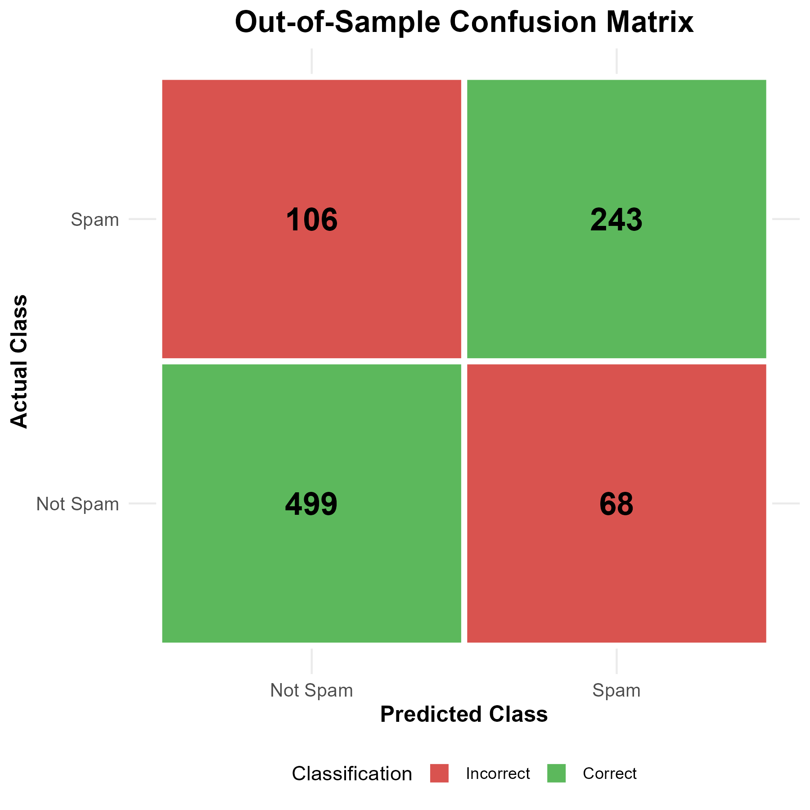

# Kernelized SVM for Spam Classification

## Overview

This project tackles the substantive problem of unsolicited commercial email (spam) by developing and evaluating a machine learning model to classify emails as either spam or legitimate (ham). The analysis uses the kernelized Support Vector Machine (kSVM) algorithm, a powerful technique for finding complex, non-linear decision boundaries in high-dimensional data.

The full analysis, methodology, and results are detailed in the project report, `mini-project-2.pdf`.

## Repository Contents

* `mini-project-2.R`: The complete R script used for data preparation, model tuning, final evaluation, and generating all results and figures.
* `mini-project-2.pdf`: The full project report in PDF format.
* `spambase.data`: The raw data file from the UCI Spambase dataset.
* `spambase.names`: The file containing attribute names and descriptions for the dataset.
* `ggplot_confusion_matrix.png`: The confusion matrix plot generated by the R script.
* `README.md`: This file.

## The Dataset

This analysis utilizes the **Spambase Data Set** from the UCI Machine Learning Repository.

* **Instances:** 4,601 email messages
* **Distribution:** 1,813 spam (39.4%) and 2,788 non-spam (60.6%)
* **Attributes:** 57 continuous features detailing the frequency of specific words (e.g., `free`, `your`), characters (e.g., `!`, `$`), and statistics on capital letter sequences.
* **Outcome:** A binary label indicating `spam` (1) or `not spam` (0).

## Methodology

The analysis strategy involved several key steps:

1.  **Data Partitioning:** The dataset was split into an 80% training set and a 20% hold-out test set for unbiased model evaluation.
2.  **Hyperparameter Tuning:** A 5-fold cross-validation approach was used on the training data to find the optimal hyperparameters for four different SVM kernels:
    * Linear (`vanilladot`)
    * Polynomial (`polydot`)
    * Radial Basis Function (RBF) (`rbfdot`)
    * Arc-Cosine (`arccos`)
3.  **Model Selection:** The kernel and parameters yielding the highest cross-validated accuracy were selected for the final model.
4.  **Evaluation & Interpretation:** The final model was trained on the full training set and evaluated on the test set. Results were interpreted using a confusion matrix and by analyzing feature correlations.

## Results

### Kernel Tuning

The RBF kernel provided the best performance during the 5-fold cross-validation tuning process.

| Kernel Type         | Best Regularization (C) | Best Kernel Param | CV Accuracy     |
| ------------------- | ----------------------- | ----------------- | --------------- |
| **RBF (`rbfdot`)** | **10.0** | **sigma = 0.1** | **0.8122** |
| Arc-Cosine (`arccos`) | 0.01                    | order = 1         | 0.7654          |
| Linear (`vanilladot`) | 0.01                    | None              | 0.7574          |
| Polynomial (`polydot`)| 0.001                   | degree = 1        | 0.7457          |

### Final Model Performance

Based on the tuning results, the RBF kernel was selected. The final model's performance on the held-out test set is summarized below.

**Out-of-Sample Confusion Matrix**


**Performance Metrics**

| Metric               | Value  |
| -------------------- | ------ |
| Accuracy             | 0.8100 |
| Precision (PPV)      | 0.7814 |
| Recall (Sensitivity) | 0.6963 |
| F1-Score             | 0.7364 |
| Specificity (TNR)    | 0.8801 |

### Feature Importance

Correlations between features and the SVM's raw prediction score reveal the most influential terms for classification.

**Top Features Indicating Spam**

| Feature                    | Correlation |
| -------------------------- | ----------- |
| `word_freq_your`           | 0.2490      |
| `word_freq_you`            | 0.2352      |
| `capital_run_length_total` | 0.1899      |
| `word_freq_all`            | 0.1743      |
| `word_freq_our`            | 0.1625      |

**Top Features Indicating "Not Spam"**

| Feature            | Correlation |
| ------------------ | ----------- |
| `word_freq_george` | -0.5329     |
| `word_freq_hpl`    | -0.1641     |
| `word_freq_hp`     | -0.1012     |
| `word_freq_re`     | -0.0088     |
| `word_freq_labs`   | -0.0001     |

## Conclusions

The kernelized SVM with an RBF kernel proved to be an effective model for spam classification, achieving **81.0% accuracy** on unseen data. The analysis highlights that spam is characterized by commercial language and aggressive formatting, while legitimate emails in this dataset were identified by personal and work-related terms, confirming the personalized nature of the filter.

## How to Run

1.  Ensure you have R installed.
2.  Install the required packages:
    ```r
    install.packages(c("kernelTools", "caret", "ggplot2"), dependencies = TRUE, type = "binary")
    ```
3.  Download `spambase.data` and `spambase.names` from the UCI Repository and place them in the same directory as the R script.
4.  Run the `mini-project-2.R` script in R or RStudio.

## References

1.  Hopkins, M., Reeber, E., Forman, G., & Suermondt, J. (1999). *Spambase Data Set*. UCI Machine Learning Repository. https://doi.org/10.24432/C53G6X
2.  Butts, C. T. (2023). *kernelTools: Select Tools for Kernel Learning*. R package version 0.8.

## Acknowledgements

Special thanks to Professor Carter T. Butts for his instruction and for developing the `kernelTools` R package that made this analysis possible.

